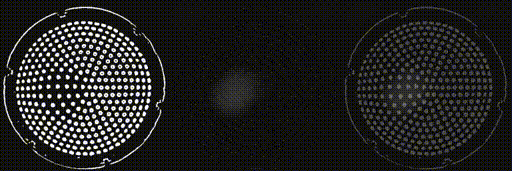

# Tactile Sim-to-Real

This repos contains data collection, training and inference scripts for the task of translating real tactile images to simulated tactile images.

<p align="center">
	
</p>

### Content ###
- [Installation](#installation)
- [Arguments](#arguments)
- [Data Collection](#data-collection)
- [Learning](#learning)
- [Prediction](#prediction)
- [Additional Info](#additional-info)


### Installation ###

This repo relies on the [Tactile Learning](https://github.com/dexterousrobot/tactile_learning) and [Tactile Data](https://github.com/dexterousrobot/tactile_data) reposotories. Please follow installation instructions within these repos first.

```
git clone https://github.com/dexterousrobot/tactile_sim2real
cd tactile_sim2real
pip install -e .
```

### Arguments ###

These can be found in ```utils/parse_args.py```.

| **Argument** |  **Description** |  **Options**  | 
| ---------------------|  ----------------------- |  ------------------ | 
| `-r` `-robot`    | Which robot is being used for data collection. This is also used to find directory of training data or pre-trained models. | `sim_ur` `ur` `sim_cr` `cr` `mg400`  |
| `-s` `-sensor` | Which sensor is being used for data collection. This is also used to find directory of training data or pre-trained models. | `sim_tactip` `tactip_127` `tactip_331` |
| `-t` `-tasks` |  This indicates the type of data that will be collected or the type of data to be used during training. | `surface_3d` `edge_2d` `spherical_probe`  |
| `-i` `-inputs` |  The base directory to be used as inputs for the pix2pix training. | `ur_tactip` `sim_tactip`  |
| `-o` `-targets` |  The base directory to be used as targets for the pix2pix training. | `sim_tactip` `ur_tactip`  |
| `-dd` `-data_dirs` |  ... | `train`, `val`   |
| `-dt` `-train_dirs` |  ... | `train`  |
| `-dv` `-val_dirs` |  ... | `val`  |
| `-m` `-models` |  NN architecture to be trained. | `pix2pix` |
| `-mv` `-model_version` |  Additional string to append to the model directory. | `exp_v1` `exp_v2` |
| `-d` `-device` |  Whether to run on the GPU or CPU | `cuda` `cpu` |

### Data Collection ###

A collection of tools for processing tactile images can be found in ```python image_transforms.py```. These are commonly used functions for processing tactile images into more consistent and reliable form. Additional, some functions useful for augmentation during training of conv nets are included.


This can be run with
```
python collect_data/launch_collect_data.py
```

### Learning ###

This can be run with

```
python learning/demo_image_generation.py
```

```
python learning/launch_training.py
```


### Prediction ###

This can be run with
```
python prediction/demo_gan.py
```


### Additional Info ###

If you use this project in your work, please cite

```

@InProceedings{...}

```